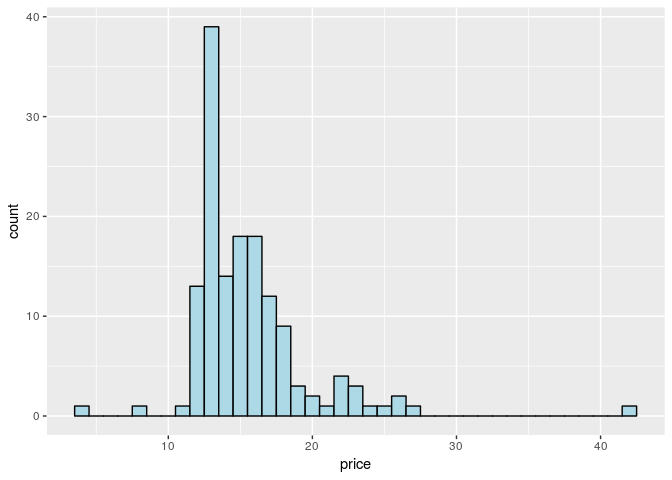
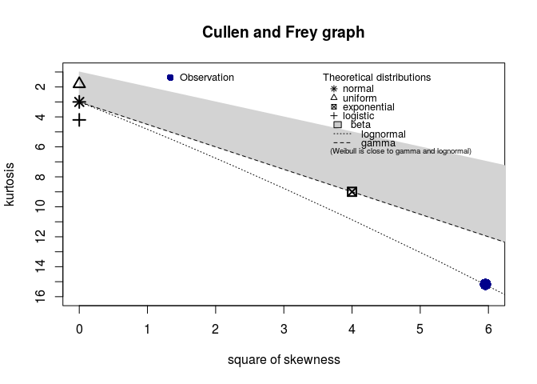
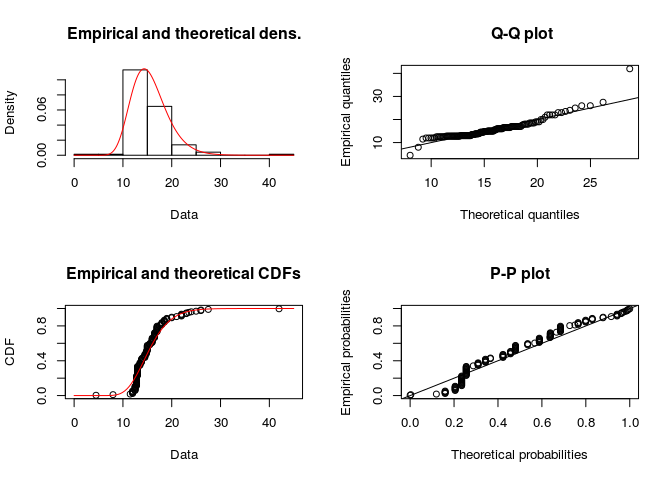
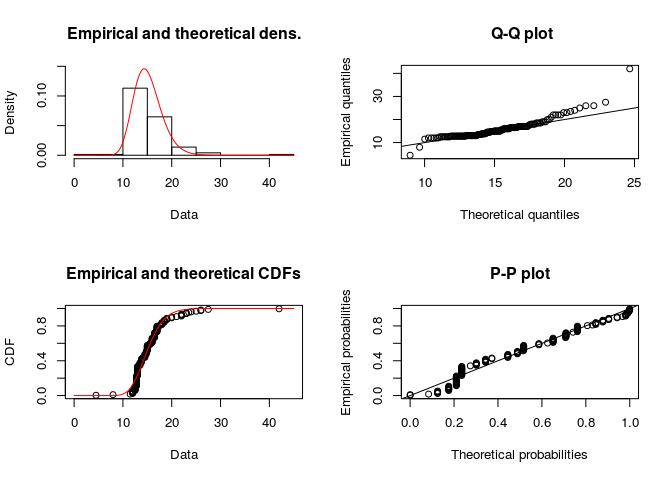

Bayesian Wine Data Analysis
================
Peter Roessler-Caram
5/7/2019

``` r
library(ggplot2)
library(ggmap)
library(readxl)
library(tidyverse)
library(maps)
library(maptools)
library(mapdata)
library(ggthemes)
library(viridis)
library(mapproj)
```

``` r
wine_data<-read_excel("/cloud/project/Data/Wine_MN.xlsx")
```

``` r
wine_mn <- wine_data 
mean(wine_mn$price)
```

    ## [1] 15.61062

``` r
##Find the average price for each province
```

\#Data Exploration

``` r
wine_mn %>% 
  ggplot() +
  geom_histogram(mapping = aes(x=price), binwidth = 1, fill = "light blue", color = "black")
```

<!-- -->

``` r
##Plot average price for each province as a histogram
```

\#Data Analysis

``` r
library(pastecs)
```

    ## 
    ## Attaching package: 'pastecs'

    ## The following objects are masked from 'package:dplyr':
    ## 
    ##     first, last

    ## The following object is masked from 'package:tidyr':
    ## 
    ##     extract

``` r
library(fitdistrplus)
```

    ## Loading required package: MASS

    ## 
    ## Attaching package: 'MASS'

    ## The following object is masked from 'package:dplyr':
    ## 
    ##     select

    ## Loading required package: survival

    ## Loading required package: npsurv

    ## Loading required package: lsei

The goal here is to uncover sample statistics from our dataset and then
an estimation of the distribution.

``` r
stat.desc(wine_mn$price)
```

    ##      nbr.val     nbr.null       nbr.na          min          max 
    ##  145.0000000    0.0000000    0.0000000    4.4900000   41.9900000 
    ##        range          sum       median         mean      SE.mean 
    ##   37.5000000 2263.5400000   14.7900000   15.6106207    0.3385541 
    ## CI.mean.0.95          var      std.dev     coef.var 
    ##    0.6691777   16.6197420    4.0767318    0.2611512

``` r
##Sample Statistics
```

``` r
descdist(wine_mn$price, discrete = FALSE)
```

<!-- -->

    ## summary statistics
    ## ------
    ## min:  4.49   max:  41.99 
    ## median:  14.79 
    ## mean:  15.61062 
    ## estimated sd:  4.076732 
    ## estimated skewness:  2.440645 
    ## estimated kurtosis:  15.17591

``` r
##Estimation of skewness and Pearson's Kurtosis values
```

The plot above helps us to estimate what possible distribution our
dataset is. The Blue dot represents where our distribution lies. From
the plot, we can assume that our dataset follows either a beta, gamma,
and possibly a weibull distribution. This isn’t definitive, but can help
narrow down our search.

``` r
fit_lnorm_mle <- fitdist(wine_mn$price, "lnorm", method = "mle")
plot(fit_lnorm_mle)
```

<!-- -->

``` r
summary(fit_lnorm_mle)
```

    ## Fitting of the distribution ' lnorm ' by maximum likelihood 
    ## Parameters : 
    ##         estimate Std. Error
    ## meanlog 2.719336 0.01959574
    ## sdlog   0.235964 0.01385516
    ## Loglikelihood:  -390.6588   AIC:  785.3175   BIC:  791.271 
    ## Correlation matrix:
    ##              meanlog        sdlog
    ## meanlog 1.000000e+00 3.858277e-12
    ## sdlog   3.858277e-12 1.000000e+00

``` r
fit_lnorm_mom <- fitdist(wine_mn$price, "lnorm", method = "mge")
```

    ## Warning in fitdist(wine_mn$price, "lnorm", method = "mge"): maximum GOF
    ## estimation has a default 'gof' argument set to 'CvM'

``` r
plot(fit_lnorm_mom)
```

<!-- -->

``` r
summary(fit_lnorm_mom)
```

    ## Fitting of the distribution ' lnorm ' by maximum goodness-of-fit 
    ## Parameters : 
    ##          estimate
    ## meanlog 2.6993866
    ## sdlog   0.1872445
    ## Loglikelihood:  -400.5845   AIC:  805.169   BIC:  811.1225
