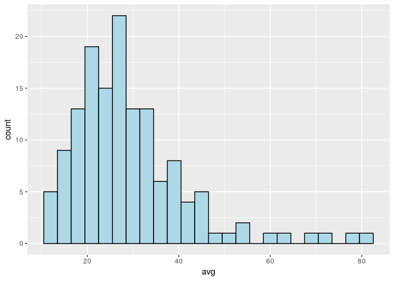
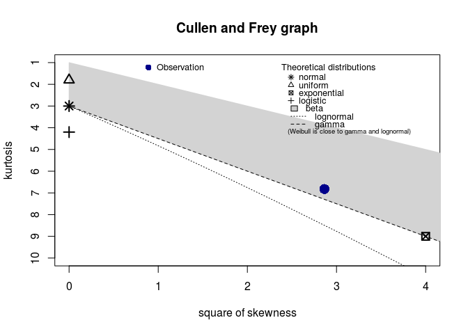
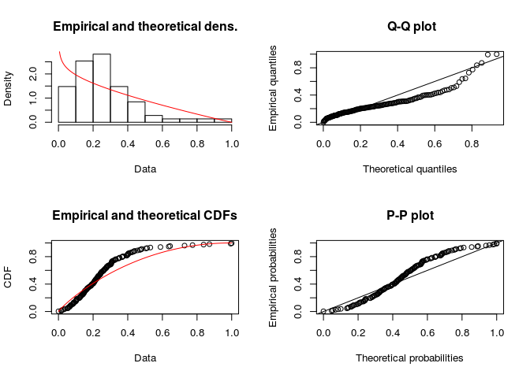
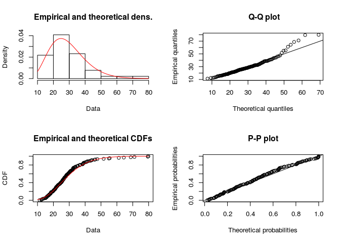
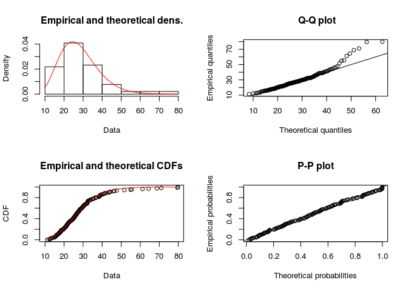

Bayesian Wine Data Analysis
================
Peter Roessler-Caram
5/7/2019

``` r
library(ggplot2)
library(ggmap)
library(readr)
library(readxl)
library(tidyverse)
library(maps)
library(maptools)
library(mapdata)
library(ggthemes)
library(viridis)
library(mapproj)
```

``` r
wine_data<-read_csv("/cloud/project/Data/Wine Data.csv")
```

    ## Warning: Missing column names filled in: 'X1' [1], 'X15' [15]

    ## Parsed with column specification:
    ## cols(
    ##   X1 = col_double(),
    ##   country = col_character(),
    ##   description = col_character(),
    ##   designation = col_character(),
    ##   points = col_double(),
    ##   price = col_double(),
    ##   province = col_character(),
    ##   region_1 = col_character(),
    ##   region_2 = col_character(),
    ##   taster_name = col_character(),
    ##   taster_twitter_handle = col_character(),
    ##   title = col_character(),
    ##   variety = col_character(),
    ##   winery = col_character(),
    ##   X15 = col_logical(),
    ##   `Points per dollar` = col_double()
    ## )

\#Data Cleaning

``` r
wine_data <- wine_data %>% 
  filter(!is.na(province)) %>% 
  filter(!is.na(price))
##Filter all NA's
wine_data %>% 
  count(province)
```

    ## # A tibble: 422 x 2
    ##    province             n
    ##    <chr>            <int>
    ##  1 Achaia               5
    ##  2 Aconcagua Costa     27
    ##  3 Aconcagua Valley   114
    ##  4 Aegean              22
    ##  5 Agioritikos          3
    ##  6 Ahr                  9
    ##  7 Alenquer             6
    ##  8 Alentejano         821
    ##  9 Alentejo           166
    ## 10 Alenteo              1
    ## # … with 412 more rows

``` r
wine_province_avg <- wine_data %>% 
  group_by(province) %>% 
  filter(n() > 24) %>% 
  summarize(avg = mean(price))
##Find the average price for each province
```

\#Data Exploration

``` r
wine_province_avg %>% 
  ggplot() +
  geom_histogram(mapping = aes(x=avg), binwidth = 3, fill = "light blue", color = "black")
```

<!-- -->

``` r
##Plot average price for each province as a histogram
```

``` r
mean(wine_province_avg$avg)
```

    ## [1] 29.24664

``` r
##Calculate average of both sets
```

\#Data Analysis

``` r
library(pastecs)
```

    ## 
    ## Attaching package: 'pastecs'

    ## The following objects are masked from 'package:dplyr':
    ## 
    ##     first, last

    ## The following object is masked from 'package:tidyr':
    ## 
    ##     extract

``` r
library(fitdistrplus)
```

    ## Loading required package: MASS

    ## 
    ## Attaching package: 'MASS'

    ## The following object is masked from 'package:dplyr':
    ## 
    ##     select

    ## Loading required package: survival

    ## Loading required package: npsurv

    ## Loading required package: lsei

The goal here is to uncover sample statistics from our dataset and then
an estimation of the distribution.

``` r
stat.desc(wine_province_avg$avg)
```

    ##      nbr.val     nbr.null       nbr.na          min          max 
    ##   142.000000     0.000000     0.000000    11.324324    79.853896 
    ##        range          sum       median         mean      SE.mean 
    ##    68.529572  4153.022724    26.773184    29.246639     1.061218 
    ## CI.mean.0.95          var      std.dev     coef.var 
    ##     2.097955   159.917973    12.645868     0.432387

``` r
##Sample Statistics
```

``` r
descdist(wine_province_avg$avg, discrete = FALSE)
```

<!-- -->

    ## summary statistics
    ## ------
    ## min:  11.32432   max:  79.8539 
    ## median:  26.77318 
    ## mean:  29.24664 
    ## estimated sd:  12.64587 
    ## estimated skewness:  1.692226 
    ## estimated kurtosis:  6.821297

``` r
##Estimation of skewness and Pearson's Kurtosis values
```

The plot above helps us to estimate what possible distribution our
dataset is. The Blue dot represents where our distribution lies. From
the plot, we can assume that our dataset follows either a beta, gamma,
and possibly a weibull distribution. This isn’t definitive, but can help
narrow down our
search.

``` r
avg_scaled <- (wine_province_avg$avg-min(wine_province_avg$avg) + .0001)/(max(wine_province_avg$avg) - min(wine_province_avg$avg) + .0002)
fit.beta <- fitdist(avg_scaled, "beta")
plot(fit.beta)
```

<!-- -->

``` r
fit_gamma_mle <- fitdist(wine_province_avg$avg, "gamma", method = "mle")
plot(fit_gamma_mle)
```

<!-- -->

``` r
summary(fit_gamma_mle)
```

    ## Fitting of the distribution ' gamma ' by maximum likelihood 
    ## Parameters : 
    ##        estimate Std. Error
    ## shape 6.5695435 0.76056192
    ## rate  0.2246436 0.02702634
    ## Loglikelihood:  -539.6741   AIC:  1083.348   BIC:  1089.26 
    ## Correlation matrix:
    ##           shape      rate
    ## shape 1.0000000 0.9622587
    ## rate  0.9622587 1.0000000

``` r
##Same for gamma
```

``` r
fit_gamma_mom <- fitdist(wine_province_avg$avg, "gamma", method = "mge")
```

    ## Warning in fitdist(wine_province_avg$avg, "gamma", method = "mge"): maximum
    ## GOF estimation has a default 'gof' argument set to 'CvM'

``` r
plot(fit_gamma_mom)
```

<!-- -->

``` r
summary(fit_gamma_mom)
```

    ## Fitting of the distribution ' gamma ' by maximum goodness-of-fit 
    ## Parameters : 
    ##       estimate
    ## shape 7.765275
    ## rate  0.276463
    ## Loglikelihood:  -541.6802   AIC:  1087.36   BIC:  1093.272
